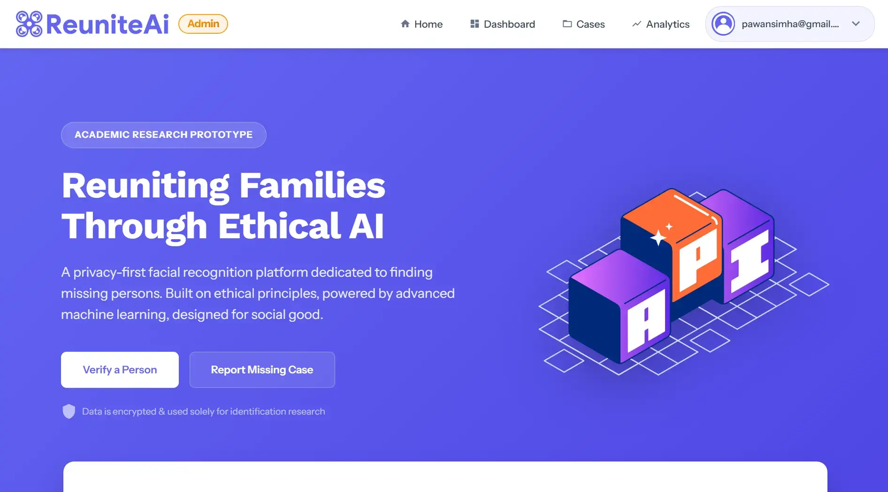
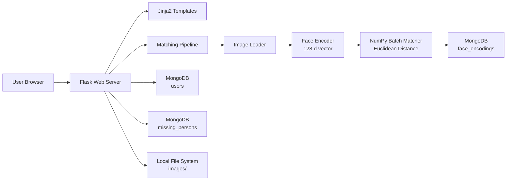

<p align="center">
  
</p>

<h1 align="center">ReuniteAI</h1>
<p align="center">
  <em>AI-powered missing person identification &mdash; reuniting families through facial biometrics.</em>
</p>

<p align="center">
  
  
  
  
  
  
</p>

---

## Problem & Value Proposition

Every year, **thousands of individuals go missing**, and traditional search methods — physical posters, manual case-file reviews, fragmented police databases — are too slow and lack cross-agency scalability. **ReuniteAI** solves this by providing a centralized, biometric-driven platform where anyone can upload a photo of an unidentified person and receive an **instant, AI-powered match** against a growing database of missing-person records.

The core value chain: **Upload → Detect → Encode → Match → Reunite.**

---

## Key Features

### 👤 User Facing
| Feature | Description |
| :--- | :--- |
| **Secure Auth** | bcrypt-hashed signup/login with session management |
| **Report Missing** | Register a missing person with full metadata & photograph |
| **AI Search** | Upload a found person's photo; receive instant similarity scores |
| **Match Results** | Detailed match view — name, guardian, contact, location, date |
| **Profile** | Self-service account management |

### 🛡️ Admin Panel
| Feature | Description |
| :--- | :--- |
| **Live Dashboard** | Aggregate stats: total users, missing cases, matched cases |
| **User Mgmt** | View and manage all registered accounts |
| **Database Control** | Browse, filter, and manage all missing-person records |
| **Case Tracking** | Automatic case-status updates (`active` → `matched`) |

---

## System Architecture



---

## Tech Stack

| Layer | Technology |
| :--- | :--- |
| **Web Framework** | Flask 3.0, Jinja2, Flask-WTF (CSRF) |
| **Face Detection** | HOG + CNN via `face_recognition` (dlib) |
| **Face Encoding** | Deep Residual Network → 128-d vector |
| **Matching Engine** | NumPy vectorized Euclidean distance |
| **Database** | MongoDB 4.4+ (`pymongo`) |
| **Auth** | `passlib[bcrypt]`, Flask session cookies |
| **Image Processing** | OpenCV 4.8, `face_recognition` |
| **Frontend** | HTML5, CSS3, Vanilla JS |
| **Environment** | `python-dotenv`, `FLASK_DEBUG` flag |
| **Testing** | `unittest` |

---

## Project Structure

```
ReuniteAI/
├── app.py                          # Flask application entry point
├── requirements.txt                # Python dependencies
├── .env.example                    # Environment variable template
├── run_reuniteai.bat               # Windows one-click launcher
├── LICENSE                         # GPL v3
│
├── python_files/                   # Core logic modules
│   ├── auth_manager.py             # Signup/login, admin init, bcrypt hashing
│   ├── db_manager.py               # MongoDB CRUD (users, encodings, persons)
│   ├── main.py                     # Orchestration: matching pipeline
│   ├── face_encoder.py             # 128-d embedding extraction
│   ├── image_loader.py             # Load & resize images (OpenCV)
│   ├── matcher.py                  # Batch Euclidean distance matching
│   ├── similarity.py               # Distance-to-similarity conversion
│   └── storage_manager.py          # Temp → database file moves
│
├── templates/                      # Jinja2 HTML templates
│   ├── base.html                   # Base layout
│   ├── login.html                  # Auth (login/signup)
│   ├── user_home.html              # User landing page
│   ├── upload.html                 # Image upload for matching
│   ├── result.html                 # Match result display
│   ├── register_missing.html       # Missing person registration form
│   ├── profile.html                # User profile
│   ├── dashboard.html              # Admin dashboard
│   ├── missing.html                # Admin: view all missing persons
│   ├── users.html                  # Admin: view all users
│   ├── contact.html                # Contact page
│   ├── 404.html                    # Custom 404 error page
│   ├── navigation.html             # Navigation bar
│   └── footer.html                 # Site footer
│
├── static/
│   ├── css/style.css               # Global stylesheet
│   ├── js/                         # Client-side scripts
│   └── images/                     # Site images & logo
│
├── images/
│   ├── temp/                       # Upload staging area (gitignored)
│   └── database/                   # Permanent record images (gitignored)
│
└── tests/
    └── test_app.py                 # Flask route unit tests
```

---

## Quick Start

### Prerequisites

- Python **3.8+**
- MongoDB instance running on `localhost:27017` (or remote — configure via `.env`)
- `dlib` system dependencies (CMake, C++ toolchain — bundled via `face-recognition` on Windows)

### Setup

```bash
# 1. Clone
git clone https://github.com/PawanSimha/ReuniteAI.git
cd ReuniteAI

# 2. Virtual environment
python -m venv venv
venv\Scripts\activate          # Windows
# source venv/bin/activate     # Linux / macOS

# 3. Install dependencies
pip install -r requirements.txt

# 4. Configure environment
copy .env.example .env         # Windows
# cp .env.example .env         # Linux / macOS
# Edit .env with your settings (see below)

# 5. Launch
python app.py
```

Open **`http://127.0.0.1:5000`** in your browser.

### Environment Variables (`.env`)

| Variable | Default | Description |
| :--- | :--- | :--- |
| `SECRET_KEY` | — | Flask session signing key **(set a strong value in production)** |
| `MONGO_URI` | `mongodb://localhost:27017/` | MongoDB connection string |
| `DB_NAME` | `reuniteai_db` | MongoDB database name |
| `ADMIN_EMAIL` | `admin@example.com` | Auto-created admin login |
| `ADMIN_PASSWORD` | `change_this_password` | Auto-created admin password |
| `FLASK_DEBUG` | `False` | Enable Flask debug mode (`True`/`1`) |

---

## API Reference

| Method | Endpoint | Auth | Description |
| :--- | :--- | :--- | :--- |
| `GET` | `/` | — | Login page |
| `GET` / `POST` | `/signup` | — | User registration |
| `POST` | `/login` | — | User login |
| `GET` | `/user/home` | Session | User landing page |
| `GET` | `/admin/dashboard` | Admin | Admin analytics dashboard |
| `GET` / `POST` | `/upload` | Session | Upload image for AI matching |
| `GET` / `POST` | `/register_missing` | Session | Register a new missing person |
| `GET` | `/profile` | Session | View user profile |
| `GET` | `/missing` | Admin | List all missing persons |
| `GET` | `/users` | Admin | List all registered users |
| `GET` | `/contact` | — | Contact page |
| `GET` | `/logout` | Session | Clear session & logout |
| `GET` | `/images/<path>` | — | Serve stored images |

---

## Roadmap

- [ ] **Mobile Companion App** — React Native or Flutter client for field operatives
- [ ] **Geo-Tagging & Maps** — Leaflet/Mapbox integration to visualize missing locations
- [ ] **SMS / Email Alerts** — Automated notification to guardians upon match detection
- [ ] **Public REST API** — Token-gated endpoints for third-party agency integration

---

## Developer Experience

### Common Issues

| Problem | Diagnosis & Fix |
| :--- | :--- |
| **`dlib` install fails** | Ensure CMake and a C++ compiler are installed. On Windows, use the pre-built `face-recognition` wheel. |
| **MongoDB `Connection refused`** | Verify MongoDB is running: `mongod --dbpath /path/to/data`. Check `MONGO_URI` in `.env`. |
| **`No face detected`** | Uploaded image may lack a clear frontal face. Try a different photo with better lighting/focus. |
| **CSRF token missing** | The app uses `flask-wtf` CSRF protection. Ensure cookies are enabled in your browser. |

### Contributing

1. Fork the repository
2. Create a feature branch (`git checkout -b feat/my-feature`)
3. Commit your changes (`git commit -am 'feat: add ...'`)
4. Push to the branch (`git push origin feat/my-feature`)
5. Open a Pull Request

All contributions must maintain or improve test coverage. Run `python -m unittest discover tests` before submitting.

---

## Author

**Pawan Simha**

[](https://github.com/PawanSimha)
[](https://linkedin.com/in/pawansimha)

---

## License

Distributed under the **GNU General Public License v3.0**. See [`LICENSE`](LICENSE) for full terms.
