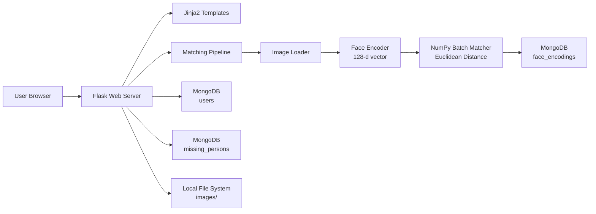

<p align="center">
  
</p>

<h1 align="center">ReuniteAI</h1>
<p align="center">
  <em>AI-powered missing person identification — reuniting families through facial biometrics.</em>
</p>

<p align="center">
  
  
  
  
  
  
  
  
  
</p>

<p align="center">
  <a href="https://github.com/PawanSimha/ReuniteAI-MissingPersonIdentifier/actions/workflows/ci.yml"></a>
  <a href="https://github.com/PawanSimha/ReuniteAI-MissingPersonIdentifier/actions/workflows/docker.yml"></a>
  <a href="https://github.com/PawanSimha/ReuniteAI-MissingPersonIdentifier/pkgs/container/reuniteai-missingpersonidentifier"></a>
</p>

---

## Product Strategy

### 🧩 Problem

Every year, thousands of individuals go missing. Traditional identification relies on physical posters, manual case-file reviews, and fragmented police databases — processes that are too slow and lack cross-agency scalability, leaving families without closure.

### 💡 Solution

**ReuniteAI** provides a centralized, biometric-driven platform where the public and authorities upload a photo of an unidentified person and receive an **instant AI-powered match** against a growing database of missing-person records.

The core value chain: **Upload → Detect → Encode → Match → Reunite.**

---

## Key Features

### 👤 User Facing
| Feature | Description |
| :--- | :--- |
| 🔐 Secure Auth | bcrypt-hashed signup/login with session management |
| 📋 Report Missing | Register a missing person with full metadata & photograph |
| 🔍 AI Search | Upload a found person's photo; receive instant similarity scores |
| ✅ Match Results | Detailed match view — name, guardian, contact, location, date |
| 🧑 Profile | Self-service account management |

### 🛡️ Admin Panel
| Feature | Description |
| :--- | :--- |
| 📊 Live Dashboard | Aggregate stats: total users, missing cases, matched cases |
| 👥 User Management | View and manage all registered accounts |
| 🗂️ Database Control | Browse, filter, and manage all missing-person records |
| 🔁 Case Tracking | Automatic case-status updates (`active` → `matched`) |

### ⚙️ Operational
| Feature | Description |
| :--- | :--- |
| 🐳 Containerized | Multi-stage Docker image + docker-compose stack (web + MongoDB) |
| 🩺 Liveness Probe | `GET /health` — HTTP 200 when app + DB are healthy, 503 otherwise |
| 🚀 CI/CD | GitHub Actions: unit tests, GHCR image publish, Trivy security scan |
| 🌐 GitHub Pages | SEO-optimized marketing site (`sitemap.xml` + `robots.txt`) |

---

## Visual Architecture

> Placeholder: insert a system architecture diagram here.
> 


```mermaid
flowchart LR
    A[User Browser] --> B[Flask Web Server]
    B --> C[Jinja2 Templates]
    B --> D[Matching Pipeline]
    D --> E[Image Loader]
    E --> F[Face Encoder<br>128-d vector]
    F --> G[NumPy Batch Matcher<br>Euclidean Distance]
    G --> H[MongoDB<br>face_encodings]
    B --> I[MongoDB<br>users]
    B --> J[MongoDB<br>missing_persons]
    B --> K[Local File System<br>images/]
```

> Placeholder: insert application screenshots here.
>  

---

## Tech Stack

| Layer | Technology |
| :--- | :--- |
| **Web Framework** | Flask 3.0, Jinja2, Flask-WTF (CSRF) |
| **Face Detection** | HOG + CNN via `face_recognition` (dlib 19.24.2) |
| **Face Encoding** | Deep Residual Network → 128-d vector |
| **Matching Engine** | NumPy vectorized Euclidean distance (<0.6 match threshold) |
| **Database** | MongoDB 7 (`pymongo`) |
| **Auth** | `passlib[bcrypt]`, Flask session cookies |
| **Image Processing** | OpenCV 4.8, `face_recognition` |
| **Frontend** | HTML5, CSS3, Vanilla JS |
| **Containerization** | Dockerfile (multi-stage), docker-compose (web + MongoDB) |
| **Registry** | GitHub Container Registry (`ghcr.io/pawansimha/reuniteai-missingpersonidentifier`) |
| **CI/CD** | GitHub Actions — `ci.yml` (tests), `docker.yml` (image + Trivy scan) |
| **Testing** | `unittest` |

---

## Project Structure

```
ReuniteAI/
├── app.py                      # Flask application entry point
├── requirements.txt            # Python dependencies
├── Dockerfile                  # Multi-stage container image
├── docker-compose.yml          # Full-stack orchestration (web + MongoDB)
├── .env.example                # Environment variable template
├── Procfile                    # Heroku-style process definition
├── LICENSE                     # GPL v3
├── PRD.md                      # Product requirements
├── README.md                   # This file
│
├── .github/workflows/          # GitHub Actions
│   ├── ci.yml                  # Unit tests (Python + MongoDB)
│   ├── docker.yml              # Build & push image to GHCR
│   └── static.yml              # Deploy marketing site to GitHub Pages
│
├── python_files/               # Core logic modules
│   ├── auth_manager.py         # Signup/login, admin init, bcrypt hashing
│   ├── db_manager.py           # MongoDB CRUD (users, encodings, persons)
│   ├── main.py                 # Orchestration: matching pipeline
│   ├── face_encoder.py         # 128-d embedding extraction
│   ├── image_loader.py         # Load & resize images (OpenCV)
│   ├── matcher.py              # Batch Euclidean distance matching
│   ├── similarity.py           # Distance-to-similarity conversion
│   └── storage_manager.py      # Temp → database file moves
│
├── templates/                  # Jinja2 HTML templates
├── static/                     # CSS, JS, images
├── images/                     # Upload staging & database (gitignored)
└── tests/
    └── test_app.py             # Flask route unit tests
```

---

## Quick Start

### 🐳 Run with Docker (recommended)

The whole stack (Flask app + MongoDB) is containerized with a healthy-by-default orchestration:

```bash
# 1. Clone
git clone https://github.com/PawanSimha/ReuniteAI-MissingPersonIdentifier.git
cd ReuniteAI-MissingPersonIdentifier

# 2. Configure environment
cp .env.example .env            # then edit SECRET_KEY, ADMIN_EMAIL, ADMIN_PASSWORD

# 3. Build & launch (first build compiles dlib: ~10-15 min, cached afterwards)
docker compose up --build
```

Then open **http://localhost:5000** — or click the Docker Desktop **`5000→:8000`** port link. MongoDB runs with a healthcheck; the web container starts only once the database is healthy.

> Note: `MONGO_URI` is overridden to `mongodb://db:27017/` inside the container, so your `.env` keeps working for local runs.

Run the app standalone (MongoDB must be reachable):

```bash
docker build -t reuniteai .
docker run -p 5000:8000 --env-file .env -v "$PWD/images:/app/images" reuniteai
```

Pull the prebuilt image:

```bash
docker pull ghcr.io/pawansimha/reuniteai-missingpersonidentifier:latest
```

### 🐍 Run locally (Python 3.11)

```bash
# 1. Clone
git clone https://github.com/PawanSimha/ReuniteAI-MissingPersonIdentifier.git
cd ReuniteAI-MissingPersonIdentifier

# 2. Virtual environment
python -m venv venv
venv\Scripts\activate          # Windows
# source venv/bin/activate     # Linux / macOS

# 3. Install dependencies (requires CMake + C++ toolchain for dlib)
pip install -r requirements.txt

# 4. Configure environment
copy .env.example .env         # then edit SECRET_KEY, ADMIN_* 

# 5. Launch (binds 0.0.0.0 on `PORT`, default 5000)
python app.py
```

### 📋 Environment Variables

| Variable | Default | Description |
| :--- | :--- | :--- |
| `SECRET_KEY` | - | Flask session signing key **(set a strong value in production)** |
| `MONGO_URI` | `mongodb://localhost:27017/` | MongoDB connection string |
| `DB_NAME` | `reuniteai_db` | MongoDB database name |
| `ADMIN_EMAIL` | `admin@example.com` | Auto-created admin login |
| `ADMIN_PASSWORD` | `change_this_password` | Auto-created admin password |
| `PORT` | `5000` | HTTP port (`8000` inside the container) |
| `FLASK_DEBUG` | `False` | Enable Flask debug mode (`True`/`1`) |

---

## API Documentation

| Method | Endpoint | Auth | Description |
| :--- | :--- | :--- | :--- |
| `POST` | `/login` | - | User login |
| `GET` / `POST` | `/signup` | - | User registration |
| `GET` / `POST` | `/upload` | Session | Upload image for AI matching |
| `GET` / `POST` | `/register_missing` | Session | Register a new missing person |
| `GET` | `/user/home` | Session | User landing page |
| `GET` | `/admin/dashboard` | Admin | Admin analytics dashboard |
| `GET` | `/health` | - | Liveness probe (Docker `HEALTHCHECK`) |
| `GET` | `/images/<path>` | - | Serve stored images |

---

## Product Roadmap

- 💬 **SMS / Email Alerts** — Automated notification to guardians upon match detection
- 🌍 **Geo-Tagging & Maps** — Leaflet/Mapbox visualization of missing-person locations
- 🔌 **Public REST API** — Token-gated endpoints for third-party agency integration
- 📱 **Mobile Companion App** — React Native or Flutter client for field operatives

---

## Developer Experience

### 🧪 Running Tests

Unit tests live in `tests/test_app.py` and require a **reachable MongoDB** (the app connects at startup):

```bash
docker compose up -d db          # container MongoDB
python -m unittest discover tests -v
```

The same suite runs automatically on every push/PR via the `ci.yml` GitHub Actions workflow.

### 🤝 Contributing

Contributions are welcome. Please read [`CONTRIBUTING.md`](CONTRIBUTING.md) — pull requests automatically trigger CI (unit tests against a fresh MongoDB + compose validation).

Also see the [`CHANGELOG.md`](CHANGELOG.md) for versioned release notes.

---

## License

Distributed under the **GNU GPLv3** License. See [`LICENSE`](LICENSE) for details.