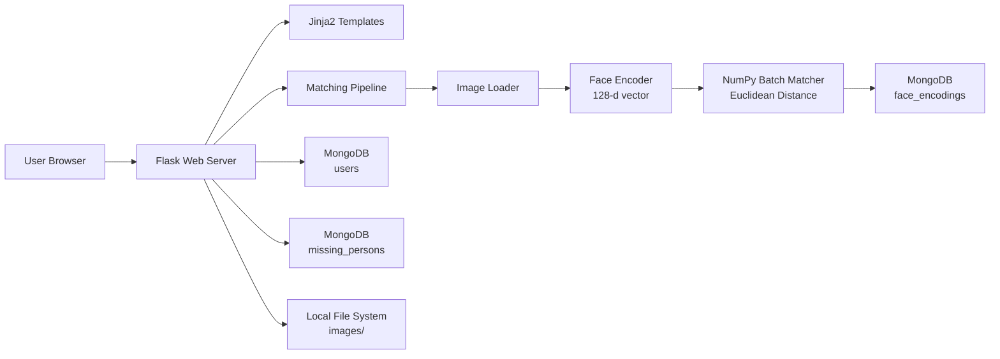

<p align="center">
  
</p>

<h1 align="center">ReuniteAI</h1>
<p align="center">
  <em>AI-powered missing person identification - reuniting families through facial biometrics.</em>
</p>

<p align="center">
  
  
  
  
  
  
  
  
</p>

<p align="center">
  <a href="https://github.com/PawanSimha/ReuniteAI-MissingPersonIdentifier/actions/workflows/ci.yml"></a>
  <a href="https://github.com/PawanSimha/ReuniteAI-MissingPersonIdentifier/actions/workflows/docker.yml"></a>
  <a href="https://github.com/PawanSimha/ReuniteAI-MissingPersonIdentifier/pkgs/container/reuniteai-missingpersonidentifier"></a>
</p>

<p align="center">
  
</p>

---

## Problem & Value Proposition

Every year, **thousands of individuals go missing**, and traditional search methods - physical posters, manual case-file reviews, fragmented police databases - are too slow and lack cross-agency scalability. **ReuniteAI** solves this by providing a centralized, biometric-driven platform where anyone can upload a photo of an unidentified person and receive an **instant, AI-powered match** against a growing database of missing-person records.

The core value chain: **Upload → Detect → Encode → Match → Reunite.**

---

## Key Features

### 👤 User Facing
| Feature | Description |
| :--- | :--- |
| **Secure Auth** | bcrypt-hashed signup/login with session management |
| **Report Missing** | Register a missing person with full metadata & photograph |
| **AI Search** | Upload a found person's photo; receive instant similarity scores |
| **Match Results** | Detailed match view - name, guardian, contact, location, date |
| **Profile** | Self-service account management |

### 🛡️ Admin Panel
| Feature | Description |
| :--- | :--- |
| **Live Dashboard** | Aggregate stats: total users, missing cases, matched cases |
| **User Mgmt** | View and manage all registered accounts |
| **Database Control** | Browse, filter, and manage all missing-person records |
| **Case Tracking** | Automatic case-status updates (`active` → `matched`) |

---

## System Architecture


```mermaid
flowchart LR
    A[User Browser] --> B[Flask Web Server]
    B --> C[Jinja2 Templates]
    B --> D[Matching Pipeline]
    D --> E[Image Loader]
    E --> F[Face Encoder<br>128-d vector]
    F --> G[NumPy Batch Matcher<br>Euclidean Distance]
    G --> H[MongoDB<br>face_encodings]
    B --> I[MongoDB<br>users]
    B --> J[MongoDB<br>missing_persons]
    B --> K[Local File System<br>images/]
```

---

## Tech Stack

| Layer | Technology |
| :--- | :--- |
| **Web Framework** | Flask 3.0, Jinja2, Flask-WTF (CSRF) |
| **Face Detection** | HOG + CNN via `face_recognition` (dlib) |
| **Face Encoding** | Deep Residual Network → 128-d vector |
| **Matching Engine** | NumPy vectorized Euclidean distance |
| **Database** | MongoDB 7 (`pymongo`) |
| **Auth** | `passlib[bcrypt]`, Flask session cookies |
| **Image Processing** | OpenCV 4.8, `face_recognition` |
| **Frontend** | HTML5, CSS3, Vanilla JS |
| **Environment** | `python-dotenv`, `FLASK_DEBUG` flag |
| **Containerization** | Dockerfile (multi-stage), docker-compose (web + MongoDB) |
| **Registry** | GitHub Container Registry (`ghcr.io/pawansimha/reuniteai-missingpersonidentifier`) |
| **CI/CD** | GitHub Actions — `ci.yml` (tests), `docker.yml` (image + Trivy scan) |
| **Testing** | `unittest` |

---

## Project Structure

```
ReuniteAI/
├── app.py                          # Flask application entry point
├── requirements.txt                # Python dependencies
├── Dockerfile                      # Multi-stage container image
├── docker-compose.yml              # Full-stack orchestration (web + MongoDB)
├── .dockerignore                   # Build context exclusions
├── .gitattributes                  # Git line-ending / binary rules
├── .editorconfig                   # Editor style conventions
├── .env.example                    # Environment variable template
├── LICENSE                         # GPL v3
├── PRD.md                          # Product requirements
├── CHANGELOG.md                    # Versioned release notes
├── CONTRIBUTING.md                 # Contribution & commit conventions
├── Procfile                        # Heroku-style process definition
├── sitemap.xml                     # SEO sitemap (GitHub Pages / marketing)
├── robots.txt                      # Crawler directives
│
├── .github/workflows/              # GitHub Actions
│   ├── ci.yml                      # Unit tests (Python + MongoDB)
│   ├── docker.yml                  # Build & push image to GHCR
│   └── static.yml                  # Deploy marketing site to GitHub Pages
│
├── python_files/                   # Core logic modules
│   ├── auth_manager.py             # Signup/login, admin init, bcrypt hashing
│   ├── db_manager.py               # MongoDB CRUD (users, encodings, persons)
│   ├── main.py                     # Orchestration: matching pipeline
│   ├── face_encoder.py             # 128-d embedding extraction
│   ├── image_loader.py             # Load & resize images (OpenCV)
│   ├── matcher.py                  # Batch Euclidean distance matching
│   ├── similarity.py               # Distance-to-similarity conversion
│   └── storage_manager.py          # Temp → database file moves
│
├── templates/                      # Jinja2 HTML templates
│   ├── base.html                   # Base layout
│   ├── login.html                  # Auth (login/signup)
│   ├── user_home.html              # User landing page
│   ├── upload.html                 # Image upload for matching
│   ├── result.html                 # Match result display
│   ├── register_missing.html       # Missing person registration form
│   ├── profile.html                # User profile
│   ├── dashboard.html              # Admin dashboard
│   ├── missing.html                # Admin: view all missing persons
│   ├── users.html                  # Admin: view all users
│   ├── contact.html                # Contact page
│   ├── 404.html                    # Custom 404 error page
│   ├── navigation.html             # Navigation bar
│   └── footer.html                 # Site footer
│
├── static/
│   ├── css/style.css               # Global stylesheet
│   ├── js/                         # Client-side scripts
│   └── images/                     # Site images & logo
│
├── images/
│   ├── temp/                       # Upload staging area (gitignored)
│   └── database/                   # Permanent record images (gitignored)
│
└── tests/
    └── test_app.py                 # Flask route unit tests
```

---

## Quick Start

### Prerequisites

- Python **3.11** (or run inside Docker - no local Python setup required)
- MongoDB instance running on `localhost:27017` (or remote - configure via `.env`)
- `dlib` system dependencies (CMake, C++ toolchain) - **only used for non-Docker runs**; the container builds & bundles dlib automatically

### Setup

```bash
# 1. Clone
git clone https://github.com/PawanSimha/ReuniteAI-MissingPersonIdentifier.git
cd ReuniteAI-MissingPersonIdentifier

# 2. Virtual environment
python -m venv venv
venv\Scripts\activate          # Windows
# source venv/bin/activate     # Linux / macOS

# 3. Install dependencies
pip install -r requirements.txt

# 4. Configure environment
copy .env.example .env         # Windows
# cp .env.example .env         # Linux / macOS
# Edit .env with your settings (see below)

# 5. Launch
python app.py
```

The dev server binds `0.0.0.0` on `PORT` (default `5000`), so it is reachable from other machines on the local network as well as the host. Open **`http://127.0.0.1:5000`** in your browser.

### Run with Docker 🐳 (recommended)

The whole stack (Flask app + MongoDB) is containerized. First, prepare your environment file from the template and set the admin credentials:

```bash
cp .env.example .env          # then edit SECRET_KEY, ADMIN_EMAIL, ADMIN_PASSWORD
docker compose up --build
```

Then open **`http://localhost:5000`** - or click the clickable **`5000→:8000`** port link shown for the `reuniteai-web` container in **Docker Desktop**. The `reuniteai-db` container runs MongoDB with a healthcheck, and the web container only starts once the database is healthy.

> Note: `MONGO_URI` inside the container is overridden to `mongodb://db:27017/` by the compose file, so your `.env` keeps working for local runs.

Or run the app container standalone (MongoDB must be reachable):

```bash
docker build -t reuniteai .
docker run -p 5000:8000 --env-file .env -v "$PWD/images:/app/images" reuniteai
```

### Environment Variables (`.env`)

| Variable | Default | Description |
| :--- | :--- | :--- |
| `SECRET_KEY` | - | Flask session signing key **(set a strong value in production)** |
| `MONGO_URI` | `mongodb://localhost:27017/` | MongoDB connection string |
| `DB_NAME` | `reuniteai_db` | MongoDB database name |
| `ADMIN_EMAIL` | `admin@example.com` | Auto-created admin login |
| `ADMIN_PASSWORD` | `change_this_password` | Auto-created admin password |
| `PORT` | `5000` | HTTP port for the dev server (`8000` inside the container) |
| `FLASK_DEBUG` | `False` | Enable Flask debug mode (`True`/`1`) |

> **Inside Docker Compose** `MONGO_URI` is automatically overridden to `mongodb://db:27017/` (the `db` service), so a shared `.env` keeps working for local runs too.

---

## API Reference

| Method | Endpoint | Auth | Description |
| :--- | :--- | :--- | :--- |
| `GET` | `/` | - | Login page |
| `GET` / `POST` | `/signup` | - | User registration |
| `POST` | `/login` | - | User login |
| `GET` | `/user/home` | Session | User landing page |
| `GET` | `/admin/dashboard` | Admin | Admin analytics dashboard |
| `GET` / `POST` | `/upload` | Session | Upload image for AI matching |
| `GET` / `POST` | `/register_missing` | Session | Register a new missing person |
| `GET` | `/profile` | Session | View user profile |
| `GET` | `/missing` | Admin | List all missing persons |
| `GET` | `/users` | Admin | List all registered users |
| `GET` | `/contact` | - | Contact page |
| `GET` | `/logout` | Session | Clear session & logout |
| `GET` | `/images/<path>` | - | Serve stored images |
| `GET` | `/health` | - | Liveness probe (Docker `HEALTHCHECK`) |

---

## Roadmap

- [ ] **Mobile Companion App** - React Native or Flutter client for field operatives
- [ ] **Geo-Tagging & Maps** - Leaflet/Mapbox integration to visualize missing locations
- [ ] **SMS / Email Alerts** - Automated notification to guardians upon match detection
- [ ] **Public REST API** - Token-gated endpoints for third-party agency integration

---

## Docker & CI/CD

### Containerization

| Artifact | Purpose |
| :--- | :--- |
| `Dockerfile` | Multi-stage build: compiles `dlib` once in a builder stage, then copies only runtime deps into a slim, non-root (`appuser`) image. Runs `gunicorn` bound to `0.0.0.0:8000` with a `/health` liveness probe. |
| `docker-compose.yml` | Orchestrates `web` + `db` (`mongo:7`) with healthchecks, a named volume for MongoDB data, and `./images` bind-mounted for uploads to survive restarts. |
| `.dockerignore` | Excludes `.git`, `venv`, secrets, and gitignored data from the build context. |

### Continuous Integration (GitHub Actions)

- **`ci.yml`** - On every push/PR to `main`: provisions a MongoDB service container, installs dependencies (dlib compilation cached via pip), runs the `unittest` suite, and validates the compose file.
- **`docker.yml`** - On push to `main` or version tags: builds the image with BuildKit cache, pushes it to the **GitHub Container Registry** (`ghcr.io/pawansimha/reuniteai-missingpersonidentifier`, tags: `latest`, `sha-<short>`, semver), then runs a **Trivy** vulnerability scan with results uploaded to GitHub Advanced Security.

Pull the prebuilt image:

```bash
docker pull ghcr.io/pawansimha/reuniteai-missingpersonidentifier:latest
```

### Liveness endpoint

`GET /health` returns `{"status":"ok","database":"ok"}` (HTTP 200) once the app and MongoDB are healthy, and HTTP 503 otherwise. It backs the Docker `HEALTHCHECK` and is ideal for orchestrators and load balancers.

---

## Developer Experience

### Common Issues

| Problem | Diagnosis & Fix |
| :--- | :--- |
| **`dlib` install fails** | Prefer Docker — the container compiles & bundles dlib automatically. Manual installs need CMake + a C++ toolchain (Linux: `build-essential cmake libboost-dev libopenblas-dev`). |
| **First `docker compose up --build` is slow** | Expected: dlib compiles from source (~10-15 min). Subsequent builds reuse BuildKit cache and are fast. |
| **Container shows unhealthy** | MongoDB isn't ready — wait for `reuniteai-db` to become healthy (`docker compose ps`); the web app starts only afterwards. |
| **Docker Desktop: no clickable port link** | Ports must be *published* (`ports: "5000:8000"`). The clickable **`5000→:8000`** link appears after the container is healthy. |
| **MongoDB `Connection refused`** | Verify MongoDB is running: `mongod --dbpath /path/to/data`. Check `MONGO_URI` in `.env` (local) or `db` (Docker). |
| **`No face detected`** | Uploaded image may lack a clear frontal face. Try a different photo with better lighting/focus. |
| **CSRF token missing** | The app uses `flask-wtf` CSRF protection. Ensure cookies are enabled in your browser. |

### Testing

Unit tests live in `tests/test_app.py` and require a **reachable MongoDB** (they import the app, which connects at startup):

```bash
docker compose up -d db          # container MongoDB
python -m unittest discover tests -v
```

The same suite runs automatically on every push/PR via the `ci.yml` GitHub Actions workflow.

### Contributing

1. Fork the repository
2. Create a feature branch (`git checkout -b feat/my-feature`)
3. Commit your changes (`git commit -am 'feat: add ...'`)
4. Push to the branch (`git push origin feat/my-feature`)
5. Open a Pull Request

All contributions must maintain or improve test coverage. Pull requests automatically trigger the `ci.yml` GitHub Actions workflow (unit tests against a fresh MongoDB + compose validation). Run `python -m unittest discover tests` locally before submitting. See [`CONTRIBUTING.md`](CONTRIBUTING.md) for the full conventions.

---

## License

Distributed under the **GNU GPLv3 License**. See `LICENSE` for more information.

---

## Links

| Platform | URL |
|----------|-----|
| **GitHub** | [github.com/PawanSimha](https://github.com/PawanSimha) |
| **LinkedIn** | [linkedin.com/in/pawansimha](https://www.linkedin.com/in/pawansimha) |
| **X / Twitter** | [x.com/pawansimha](https://x.com/pawansimha) |
| **Google Developer** | [g.dev/pawansimha](https://g.dev/pawansimha) |
| **Google Skills Profile** | [skills.google.com/public_profiles/9108dded-855b-466a-b261-0a7519d472cf](https://www.skills.google.com/public_profiles/9108dded-855b-466a-b261-0a7519d472cf) |
| **Credly Badges** | [credly.com/users/pawansimha/badges](https://www.credly.com/users/pawansimha/badges) |

---

<p align="center">
  <b>Pawan Simha R</b>
  <br />
  <sub>Built with Flask 3.0 · MongoDB · face_recognition · OpenCV</sub>
</p>
